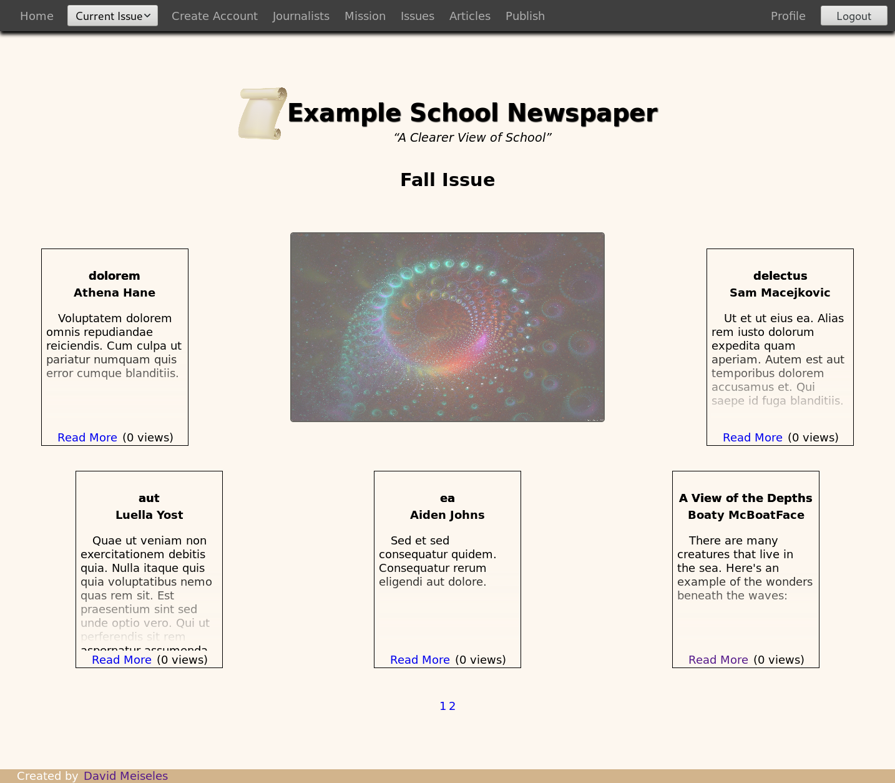

# newspaper-site

This is the code behind my school newspaper\'s site.

For more pictures, see `docs/level-3/images/`

## Table of Contents

<!-- vim-markdown-toc GFM -->

* [About](#about)
* [Types of users](#types-of-users)
* [Publishing - From start to end](#publishing---from-start-to-end)
  * [Commenting](#commenting)
  * [Tags - An explanation](#tags---an-explanation)
* [Signup/account deletion](#signupaccount-deletion)
  * [Signing up](#signing-up)
  * [Deleting your account](#deleting-your-account)
* [Build Instructions](#build-instructions)
  * [Installation](#installation)
  * [Config Files](#config-files)
  * [Firing Up](#firing-up)
    * [Docker](#docker)
    * [Manual](#manual)
  * [Database Information](#database-information)

<!-- vim-markdown-toc -->

## About
This is a newspaper site. Simply put, one can create an account, publish articles, and eventually have it world viewable. It is designed to be a fully featured web-app.

## Types of users
In this site there are 4 types of users. Note that each type of user can do at least that of the user before it.
<ol>
    <li>
      

        
Random, not logged in users

        
          - Can view all articles in world viewable issues
          - Can see basic info about all users (name, articles created, views)
          - Can view individual users\' profiles
        
    </li>
    <li>
      

        
Level 1 users

          
              - Can create articles
              - View all articles whether world-viewable or not
              - Delete their own articles
              - Edit their own articles <u>until it becomes world-viewable</u>
              - Delete their own account
              - Manage their own notification settings
              - Toggle their own two factor authentication
              - Change their own password
          
        

    </li>
    <li>
      

        
Level 2 users

          
              - Can delete users less than themselves
              - Create other users of the same or lower level
              - Can add to the list of available tags one can give articles when publishing
          
      

    </li>
    <li>
      

        
Level 3 users

          
              - Can make issues world-viewable
              - Give an issue a name (until it becomes world viewable)
              - Delete any article
              - Change the order articles display on the home page
              - Update an article\'s tags
              - Edit any article (even after it becomes world-viewable)
              - Edit the mission statement
              - Get notified whenever an article is published
          
      

    </li>
</ol>

## Publishing - From start to end
<ol>
    <li>
        

            
Logged in user goes to `/publish`, fills out the form

            

              An email goes out to all level 3 users who have notifications enabled that an article was created  
               At this point, even if the user who published it is level 1, they can edit it  
               At any point from here on the creator or level 3 users can delete it

        

    </li>
    <li>
        

            
After a few articles have been uploaded, you might decide it\'s time to make the issue world viewable, and publish the issue. To do this, a level 3 user goes to `/issue`, gives the issue a name, toggles the "Published" table cell to "Yes", and submits the form

            At this point, only level 3 users can edit the article, although both the owner and level 3s can still delete articles  The issue name is now permanent, and the issue cannot be set to private again
        

    </li>
    - Done. The next article published will be in a new, private issue
</ol>

### Commenting

    - Comments must be at least 5 characters long
    - Can only comment on public articles 
    - Views only increment when not logged in, and when viewing public articles

### Tags - An explanation

    - When creating an article, one can pick from a list of tags (or if you\'re level 2+, create a new tag)
    - These are used so readers can easily find articles that they\'re interested in

## Signup/account deletion
### Signing up

    - Fill out form on /signup
    - You\'ll get an email with a verification code
    - When you try to log in, after putting in your regular info, you\'ll be redirected to a page which asks for the code which was emailed to you
    - You\'re in!

### Deleting your account

    - When an account gets deleted (whether by deleting your own account, or an admin deleting someone else\'s account), a question arises: What to do with the articles the user has published
    - The answer? They get transferred to a special user called User Deleted, and so live on

## Build Instructions

### Installation
    1. $ `git clone https://gitlab.com/d.a.v.i.d.m/newspaper-site`
    2. $ `cd newspaper-site`

### Config Files

Create a file called `.env` in `server/`
Before beginning, there is a `.env.example` file for every `.env` you will create which has all variables needed (so you can copy/paste that into your newly created `.env`)

If you plan on using Docker (recommended) read that section before continuing

  
Example `server` `.env`

  <pre>
    DB_HOST="name_of_database_host" # likely "localhost"
    DB_PORT="port_the_db_is_on" # a common one is 3306
    DB_USER="db_username" # default might be "root"
    DB_PASS="strong_password" # default might be "root". Strongly suggested to change if in production
    DB_NAME="name_of_database" # database to use. Does not (and should not) exist before using this project

    EMAIL_ADDR="example@example.org" # used when sending any emails (such as 2 step auth, or after publishing an article)
    EMAIL_PASS="strong_password" # this will also be the default admin password, to change, log in and go to profile
    EMAIL_HOST="smtp.gmail.com" # if using gmail. It might be smtp.domain.tld if you\'re not sure
    EMAIL_PORT="587" # port for sending secure messages (using ssl)
    EMAIL_NAME="Newspaper" # whatever you want users to see when looking at who sent them an email
    USER_EMAIL_HOST="gmail.com" # if you want to restrict users who sign up to a specific email provider. Use "*" to allow all email addresses

    URL_LENGTH="6" # minimum length of article urls (see /publish)

    test=0 # don\'t change unless you\'re contributing and have read CONTRIBUTING.md
    dev=0 # change to 1 if you are running in development (so can see errors)

    JWT_SECRET="extremely_secure_random_password" # this is what prevents random people from logging in as others. I recommend using a password generator
  </pre>

  
Example `database` `.env`

    If these are changed, also change corresponding DB_ in server/.env
    <pre>
       MYSQL_DATABASE=eyestorm_newspaper_db
       MYSQL_PASSWORD=newpaper_password
       MYSQL_USER=eyestorm_newspaper
    </pre>

  
Example `client` `.env`

    <pre>
      REACT_APP_SERVER_URL=http://localhost
    </pre>

### Firing Up

You MUST have filled out `server`, `client`, and `database` `.env`s before this step

#### Docker
  - `client`\'s `REACT_APP_SERVER_URL` and `server`\'s `DB_HOST` will NOT be what is defined in `.env` and will instead be what it defined in `docker-compose.yml`. You don\'t need to care about that, just fill in whatever you want as those fields in the `.env` files
  - Run `docker-compose up --build` in the root directory, then go to `localhost:3000`

#### Manual
  
<ol>
    <li>Install `composer` from [https://getcomposer.org/download/](https://getcomposer.org/download/) (to check if you already have it run $ `composer -V`)
    <li>
      

        

          $ `./install-all --email="your_email" --password="secure_password"`
        

        
          <li>Note: If the script fails to run, you may need to adjust the shebang (first line in the file)
           to the output of $` which php`, or the path to whatever php version your webserver is running (possibly #!/usr/local/bin/php)
          </li>
          <li>To see options that can be passed in, run $ `./install-all -h` (in particular, if you want to have some prefilled data, add `--fill-db="true"`)
          - Installs npm modules needed for frontend
          - Uploads database schema to the database named in .env#DB_NAME
          - Creates an account with the username "admin" with the email and password passed in
        
    </li>
    - To run on localhost: $ `cd client/`, $ `npm start`, and start your webserver pointing at `server/public/`, then go to [http://localhost:3000](http://localhost:3000)
    - To run in production: $ `cd client/`, $ `npm run build`, copy the contents of `public/` and `server/` to your server. You may need to adjust `server/public/.htacess#Header set Access-Control-Allow-Origin`, to the url of your front-end site, and switch `client/src/index.tsx`\'s `localhost` to the url of your server
</ol>

### Database Information

Note: You don\'t need to know any of this to use the project
See `server/src/test/GenerateMockRow.php` and/or `schema.sql`
